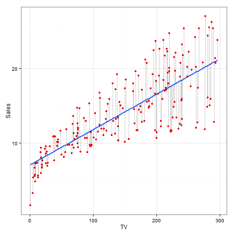

```{r, echo=FALSE, include = FALSE}
load("../data/regression.RData")
require(xtable)
```
#Abstract 
The analysis is an attempt to reproduce the results found in Section 3.1 of *Simple Linear Regression* (chapter 3) of the book **An Introduction to Statistical Learning**. This is an exploration of Simple Linear Regression. 

#Introduction
This analysis takes Advertising data and attempts to map a linear relationship between TV advertising budget and product sales. The best way to do this is through the method of least squares. 

#Data
In this analysis we take data from 200 distinct markets. This data is contained in `Advertising.csv` which has five variables: `X` a counter, `Sales` the product sales in thousands of units, and `TV`, `Radio`, and `Newspaper` the advertising budgets for each medium in thousands of dollars. In this simple regression case, we only look at `TV` and how this correlates to `Sales`. 

#Methodology 
As the title of this report suggests, this is a simple linear regression analysis. We use the linear model $$y \approx \beta_0 + \beta_1*x$$ to describe the relationship between `Sales` and `TV`. Therefore, the linear model looks more like this: $$Sales \approx \beta_0 + \beta_1*TV$$ where $\beta_0$ is the intercept term and $\beta_1$ is the slope term. As mentioned before, the best way to estimate the variables in this model is through the least squares method. $\hat{\beta_0}$ and $\hat{\beta_1}$ are the least squares estimators of $\beta_0$ and $\beta_1$. By the Gauss-Markov Theorem they are the best linear unbiased estimators. They are estimated by minimizing the sum of the residual squared errors (RSS): $$RSS = e^2_1+e^2_2+ \cdots +e^2_n$$ where $e_i$ is equal to $y_i-\hat{y_i}$. $\hat{y_i}$ is the predicted y value. In terms of this analysis, $\hat{y_i}$ is the amount of predicted sales based off of the TV advertising budget. Therefore, RSS can also be written as: $$RSS = \displaystyle\sum_{i=1}^{n} (y_i-\hat{\beta_0}-\hat{\beta_1})$$ Minimizing this value over $\hat{\beta_0}$ and $\hat{\beta_1}$ results in $$\hat{\beta_1} = \frac{\sum_{i=1}^n (x_i-\bar x)(y_i- \bar y)}{\sum_{i=1}^{n}(x_i-\bar x)^2}$$ $$\hat{\beta_0} = \bar y - \hat{\beta_1}*\bar x$$ Using the `Advertising.csv` data we replace the $y_is$ with the `Sales` numbers and the $x_is$ with the `TV` numbers. 

#Results 
Using R we find the values for $\hat{\beta_0}$ and $\hat{\beta_1}$ and information about their accuracy. 

```{r, results = "asis", echo = FALSE}
print(xtable(ls_reg, caption = "Information About Regression Coefficients"), type = "latex", comment = FALSE)
```
`Std. Error` is a measure of the volatility of the estimates and the last two columns are indicators of the validity of the estimate. In this case since the p-value (the last column) is practically zero, then we know that the estimates are validly nonzero. 

The following statistics validate the accuracy of the linear model $$Sales \approx \beta_0 + \beta_1*TV$$ These statistics calculate whether `Sales` and `TV` can really be modeled in the above way. 

```{r, results = "asis", echo = FALSE}
data <- c(summary_ls$sigma, summary_ls$r.squared, summary_ls$fstatistic[1])
lbls <- c("RSE", "R2", "F-Stat")
fit_anl <- data.frame(Quantity = lbls, Value = data)

print(xtable(fit_anl, caption = "Regression Quality Statistics"), type = "latex", include.rownames = FALSE, comment = FALSE)
```
`RSE` is the residual standard error, which is a measure of the accuracy of the predicted values of `Sales` that you can get from the model. In mathematical terms, this is $$RSE = \sqrt{\frac{1}{n-2} RSS} = \sqrt{\frac{1}{n-2} \displaystyle\sum_{i=1}^{n} (y_i-\hat{y_i})^2}$$ This adds the differences between the actual and predicted values of the y's which in this case is the `Sales` numbers. `RSE` equal to `r summary_ls$sigma` indicates that the predicted `Sales` number is off by approximately `r summary_ls$sigma*1000` units.

The $R^2$ statistic measures proportionally how much of the variability of `Sales` can be due to `TV`. Mathematically, $$R^2 = \frac{TSS-RSS}{RSS} = 1-\frac{RSS}{TSS}$$ where $TSS = \sum_{i=1}^{n}(y_i-\bar y)^2$

The F-Statistic is a measure of how good the model is. It uses the `RSS` and the `TSS` just like the $R^2$ statistic, but also incorporates the F distribution. 

Using the estimates $\hat{\beta_0}$ and $\hat{\beta_1}$, we can plot out the data points of TV advertising budget and product sales. 



The red dots represent the data points (`TV`, `Sales`) for each market. The blue line is the best fit regression line. This line is $Sales = \hat{\beta_0} + \hat{\beta_1}*TV$ where `TV` is an arbitrary TV budget value and `Sales` is the predicted product sales amount based on that `TV` value. The light grey lines are the residuals or $y_i-\hat{y_i}$. So this line shows the difference between the actual value of `Sales` and the predicted value of `Sales` calculated from the model using the `TV` values from the data. As the graph indicates, the model is a better predictor of `Sales` for small values of `TV`, but from the statistics calculated above we see that overall the model is a good fit. 

#Conclusion
Using the statistics on the estimates $\hat{\beta_0}$ and $\hat{\beta_1}$, the model analysis, and the visual representation of the least squares fitted line, we can see that the model $Sales \approx \beta_0 + \beta_1*TV$ was a reasonable assumption. 